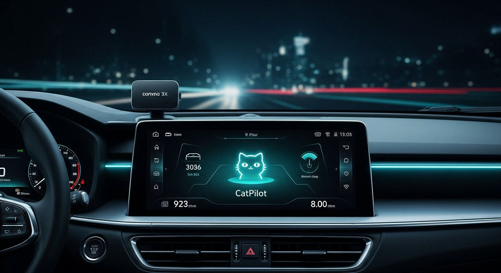
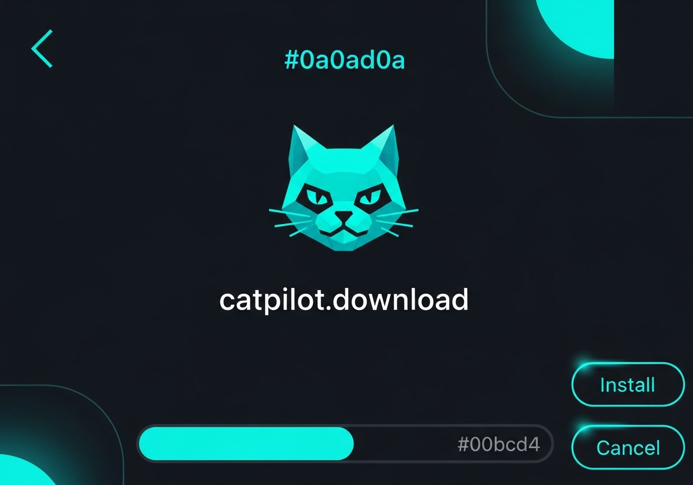

What is catpilot?
------

[catpilot](http://github.com/commaai/catpilot) is an open source driver assistance system. Currently, catpilot performs the functions of Adaptive Cruise Control (ACC), Automated Lane Centering (ALC), Forward Collision Warning (FCW), and Lane Departure Warning (LDW) for a growing variety of [supported car makes, models, and model years](docs/CARS.md). In addition, while catpilot is engaged, a camera-based Driver Monitoring (DM) feature alerts distracted and asleep drivers. See more about [the vehicle integration](docs/INTEGRATION.md) and [limitations](docs/LIMITATIONS.md).

What is CatPilot? 🐱
------

CatPilot is a fully open-sourced fork of catpilot, featuring clear and concise commits striving to be a resource for the catpilot developer community. It thrives on contributions from both users and developers, focusing on a collaborative, community-led approach to deliver an advanced catpilot experience for everyone!

------
CatPilot was last updated on:

**January 5th, 2026**

Features
------

CatPilot offers a wide range of customizable features that are easily toggled on or off to suit your preferences. Whether you want a completely stock catpilot experience, or want to add some fun and personal touches, CatPilot has you covered! Some of the features include:

------
⚡ **Advanced Customizations:**

  - "Alert Volume Controller" to set the volume level for each of of catpilot's sounds
  - Customize the following distance and jerk values for each personality profile
  - Fine tune your car's "Steer Ratio" to perfect your lateral control
  - Increase the distance when stopped behind lead vehicles
  - Increase the max set speed by a custom interval (i.e. 2, 3, 4, 5, 6, etc. instead of just 1)
  - Select between past, present, and future catpilot driving models
------
🎨 **Custom Themes:**

  - 🐱 Cat theme (with a bonus 😺 sound effect)
  - 🔌 Tesla theme
  - Holiday themes! Minor holidays last a day, while major holidays (Easter, Halloween, Thanksgiving, Christmas) last a week
  - Random events triggered by specific actions while driving with catpilot

  - 📢 Want to add a theme? Submit a pull request on GitHub!
------
🚀 **Conditional Experimental Mode:**

  - Auto-activates "Experimental Mode" under several conditions, including:
    - Approaching intersections and turns while using navigation
    - Approaching slower vehicles to take advantage of "Experimental Mode"'s smoother braking
    - Curve and stop light/stop sign detection
    - Driving below a set speed
    - Turn signal activation below 55mph for turn assistance
------
📊 **Developer UI:**

  - Display various driving logics such as the distance, speed, and the desired following distance to your lead vehicle
  - Lane measuring of the adjacent lanes for lane detection
  - Tap the "VEHICLE ONLINE"/"CPU"/"GPU" gauge to toggle between CPU and GPU monitoring
  - Tap the "CONNECT ONLINE"/"MEMORY"/"LEFT"/"USED" gauge to toggle between RAM and storage monitoring
------
🛠 **Device Management:**

  - Adjustable screen brightness for both onroad and offroad states
  - Adjustable screen timeout times for both onroad and offroad states
  - Backup and restore previous versions of CatPilot
  - Backup and restore previous versions of toggle configurations
  - Battery level threshold to automatically shut the device down after you car's battery falls below a set voltage limit when offroad
  - Delete stored driving data for increased privacy/space via the "Device" panel
  - Device can operate offline indefinitely
  - Disable logging and/or uploading
  - Disable uploads while onroad to help reduce data usage
  - Flash the Panda within the "Device" menu
  - "Standby Mode" that wakes the screen up between engagement states or when important alerts are triggered
  - Timer to automatically shut down after going offroad
------
🚖 **Lateral Adjustments:**

  - Activate lateral control by simply pressing the "Cruise Control" button
  - Force comma's auto tuning for unsupported vehicles
  - Lateral control won't disengage on gas or brake
  - Nudgeless lane changes with lane detection to prevent driving into curbs or going offroad
  - Pause lateral control when below a set speed
  - Pause lateral control when pressing the brake
  - Pause lateral control when turn signals are active
  - Precise turns by using turn desires when below the minimum lane change speed
  - [Twilsonco's NNFF](https://github.com/twilsonco/catpilot) for smoother steering control
------
🚘 **Longitudinal Adjustments:**

  - Aggressive acceleration when following a lead vehicle from a stop
  - "Map Turn Speed Controller" to slow down for curves based on stored map data
    - With an additional toggle to fine tune the speed aggressiveness
  - Smoother braking behind slower leads
  - "Speed Limit Controller" to adjust your speed to the posted speed limit
    - With additional toggles to set offsets for "0-34 mph", "35-54 mph", "55-64 mph", and "65-99 mph"
  - "Sport" and "Eco" acceleration and deceleration profiles
  - "Traffic Mode" tailored towards driving in traffic
  - Tweak the lead detection threshold to detect leads sooner for smoother braking on stopped/slower vehicles
  - "Vision Turn Speed Controller" for smoother handling of curves
    - With additional toggles to fine tune the speed aggressiveness and curve detection sensitivity
------
🗺️ **Navigation:**

  - 3D buildings
  - Custom map styles
  - Full screen map that takes up the entire screen for a more expansive map view
  - iOS shortcuts to quickly set navigation destinations
  - Navigate on catpilot without a comma prime subscription
  - Offline maps
  - "Open Street Maps" integration for speed limit control and road name view
------
🎮 **Onroad UI:**

  - Compass that rotates according to the direction you're driving
  - FPS counter in the screen's border
  - Hide various UI elements on the screen for a cleaner UI
  - Pedals on the onroad UI indicate when the gas/brake pedals are being used
  - Road UI Customizations:
    - Acceleration path to show the model's desired acceleration/deceleration
    - Blind spot path when a vehicle is detected in your blind spot
    - Increase/decrease the lane line, path, and road edge widths
    - Path edge colors based on specific driving statuses:
      - 🔵 Blue - Navigation active
      - 🟦 Light Blue - "Always On Lateral" active
      - 🟢 Green - Default
      - 🟠 Orange - "Experimental Mode" active
      - 🔴 Red - "Traffic Mode" active
      - 🟡 Yellow - "Conditional Experimental Mode" overridden
    - "Unlimited" road UI that extends out as far as the model can see
  - Sidebar retains it's previous position between reboots/ignition cycles
  - Steering wheel icons
    - 📢 Submit your own steering wheel icon via pull request!
  - Steering wheel in the onroad UI rotates alongside your physical steering wheel
------
🚙 **Vehicle Specific Additions:**

  - Automatic/manual fingerprint selection to force a selected fingerprint
  - Custom longitudinal tunings for GM EVs and trucks for smoother gas and brake control
  - Custom longitudinal tunings for Toyota/Lexus for smoother gas and brake control
  - Disable catpilot longitudinal control to use your car's stock cruise control
  - GM Volt support
  - Honda Clarity support
  - Increased torque for the Subaru Crosstrek
  - Lock doors automatically when in the drive gear for Toyota/Lexus and unlock when in park
  - catpilot longitudinal control for GM vehicles without ACC
  - Pedal interceptor support for GM vehicles
  - "Stop and Go" hack for Toyota's without stop and go functionality
  - ZSS support for the Toyota Prius and Sienna
------
🚦 **Quality of Life Features:**

  - Automatic updates for a completely "set and forget" experience
  - Camera view selection
  - Custom alerts for green lights, vehicles in blindspot, lead departing, and the current speed limit changing
  - Display the driver camera when in reverse
  - Driving statistics to show how many hours and miles you've driven on the home screen
  - Fleet Manager to easily access your driving data and screen recordings
  - Numerical temperature gauge
  - Retain tethering status between reboots
  - Screenrecorder
  - Toggle "Experimental Mode" via the "Lane Departure Alert" button, holding down the "Distance" button for 0.5+ seconds, or by double tapping the screen

How to Install
------

To install CatPilot on your comma 3X device:

1. Connect your comma device to WiFi
2. Navigate to the software installation screen
3. Select "Custom Software" option
4. Enter the CatPilot GitHub repository URL
5. Follow the on-screen prompts to complete installation

**Note:** Do NOT install the "CatPilot-Development" branch unless you want to test experimental features.

Bug reports / Feature Requests
------

If you encounter any issues or bugs while using CatPilot, or if you have any suggestions for new features or improvements, please open an issue on GitHub! We're always looking for ways to improve the fork and provide a better experience for everyone.

To report a bug or request a new feature, please open an issue on the CatPilot GitHub repository. Provide as much detail as possible about the issue you're experiencing or the feature you'd like to see added. Photos, videos, log files, or other relevant information are very helpful!

We will do our best to respond to bug reports and feature requests in a timely manner, but please understand that we may not be able to address every request immediately. Your feedback and suggestions are valuable, and we appreciate your help in making CatPilot the best it can be!

Credits
------

* **[Agentia Compiler](docs/AUTHORS.md#agentia-compiler)** - Co-developer
* [AlexandreSato](https://github.com/AlexandreSato)
* [Crwusiz](https://github.com/crwusiz)
* [DragonPilot](https://github.com/dragonpilot-community)
* [ErichMoraga](https://github.com/ErichMoraga)
* [Garrettpall](https://github.com/garrettpall)
* **[Jason Bender](docs/AUTHORS.md#jason-bender)** - Fork maintainer and co-developer
* [Mike8643](https://github.com/mike8643)
* [Neokii](https://github.com/Neokii)
* [OPGM](https://github.com/opgm)
* [OPKR](https://github.com/catpilotkr)
* [Pfeiferj](https://github.com/pfeiferj)
* [ServerDummy](https://github.com/ServerDummy)
* [Twilsonco](https://github.com/twilsonco)

Licensing
------

CatPilot is released under the MIT license. Some parts of the software are released under other licenses as specified.

Any user of this software shall indemnify and hold harmless Comma.ai, Inc. and its directors, officers, employees, agents, stockholders, affiliates, subcontractors and customers from and against all allegations, claims, actions, suits, demands, damages, liabilities, obligations, losses, settlements, judgments, costs and expenses (including without limitation attorneys’ fees and costs) which arise out of, relate to or result from any use of this software by user.

**THIS IS ALPHA QUALITY SOFTWARE FOR RESEARCH PURPOSES ONLY. THIS IS NOT A PRODUCT.
YOU ARE RESPONSIBLE FOR COMPLYING WITH LOCAL LAWS AND REGULATIONS.
NO WARRANTY EXPRESSED OR IMPLIED.**

---

</img> </img>
